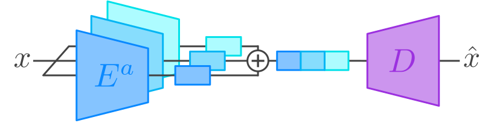
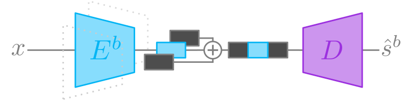
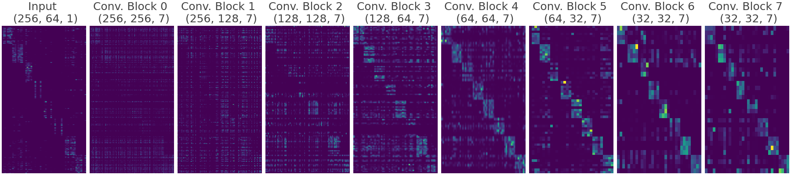
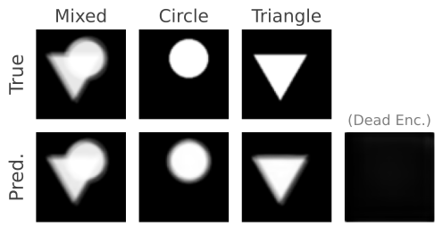
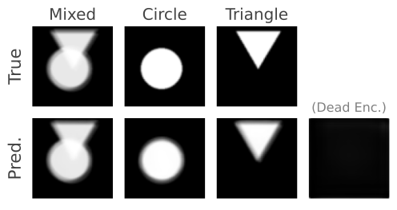
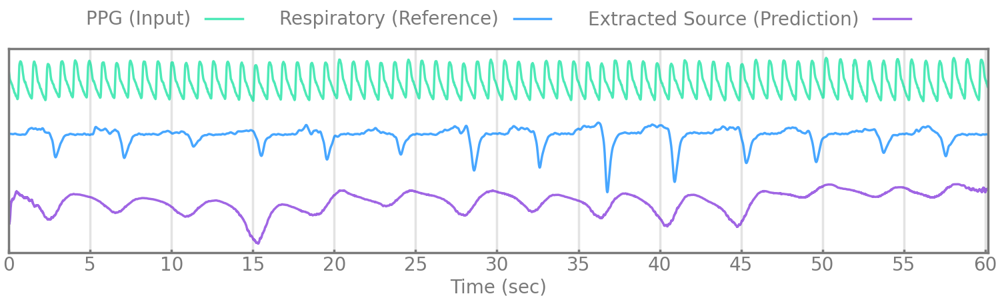
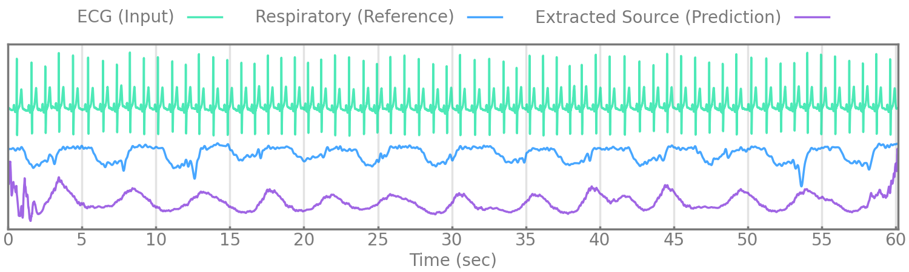

# Self-Supervised Blind Source Separation via Multi-Encoder Autoencoders

**Paper link (pdf):** _coming soon, undergoing peer review_

## Summary
We propose a novel methodology for addressing blind source separation of non-linear mixtures via multi-encoder single-decoder autoencoders with fully self-supervised learning. During training, our methodology unmixes the input into the multiple encoder output spaces and then remixes these representations within the single decoder for a simple reconstruction of the input. Then to perform source inference we introduce a novel _encoding masking_ technique whereby masking out all but one of the encodings enables the decoder to estimate a source signal. To achieve consistent source separation, we also introduce a so-called **pathway separation loss** for the decoder that encourages sparsity between the unmixed encoding spaces throughout and a so-called **zero reconstruction loss** on the decoder that assists with coherent source estimations. We conduct experiments on a toy dataset, the _triangles & circles_ dataset, and with real-world biosignal recordings from a polysomnography sleep study for extracting respiration.
<p align="center">
    
  <p align="center">
      Figure 1a. Training procedure.
  </p>
</p>
<p align="center">
    
    <p align="center">
      Figure 1b. Inference procedure (source estimation).
  </p>
</p>

## Method & Key Contributions
As the foundation of our proposed methodology, we use multi-encoder autoencoders such that each encoder recieves the same input, and the outputs of each encoder are concatenated along the channel dimension before being propagated thorugh the single decoder network. In addition, we propose two novel regularization methods and a novel encoding masking technique for inference. These three contributions are outlined below...
### 1. Enoding masking for blind source estimation
To estimate a source (i.e. seperate a source) with a trained model the $n\text{th}$ encoder $E^{n}$ left active while all other encodings are masked out with zero vectors $\mathbf{0}$. The concatenation of the active encoding with the masked encodings $Z^n$ are passed into the decoder $D$ to give the source estimation $\hat{s}^n$.

$$Z^n = \left[\mathbf{0} \oplus \ldots \oplus E^{n}(x)  \oplus \ldots \oplus \mathbf{0} \right]$$

$$\hat{s}^n = D(Z^n)$$

### 2. Pathway separation loss
The pathway separation loss is applied along the channel dimension for each layer's weight $W$ in the decoder (except the output layer) to encourage sparse mixing of the encodings and their mappings throughout the decoder. This is done by partitioning the weights into a set of blocks $B_{i,j} \in \mathbf{B}$ that decode individual encoding spaces and then by decaying the off-diagonal blocks (parameters responsible for mixing encodings) towards zero. See [models/separation_loss.py](models/separation_loss.py) for our two proposed approaches to the pathway separation loss.
<p align="center">
  
    <p align="center">
      Figure 2. The final decoder weights of the multi-encoder autoencoder model trained on the ECG data are visualized above. The absolute values of the weights are summed along the spatial dimensions to show the effect of the pathway separation loss.
    </p>
</p>

The term "pathway" comes from the fact that as the off-diagonal blocks decay towards zero, the on-diagonal blocks create a pathway from layer to layer in the decoder where little mixing of the encoding spaces occurs i.e. each encoding gets its own separate set of densely connected blocks through the decoder.

### 3. Zero reconstruction loss
The zero reconstruction loss is proposed to ensure that masked source encodings have minimal contribution to the final source estimation. For the zero reconstruction loss, an all-zero encoding vector $Z_{\text{zero}}$ is passed into the decoder, and the loss between the reconstruction $\hat{x} _{zero}$ and the target $x_{\text{zero}}$, an all-zero vector equal to the output size, is minimized.

$$\mathcal{L}_{\text{zero recon.}} = \text{BCE}(x_{\text{zero}}, D_{\phi}(Z_{\text{zero}}))$$

## Experiments
### Triangles & Circles
#### 1. Getting Started with the _triangles & circles_ dataset
The _triangles & circles_ dataset consists of non-linear mixtures of triangle and circle shapes with uniform random position in size and position. To generate your own dataset please see: [notebooks/triangles_and_circles_dataset.ipynb](notebooks/triangles_and_circles_dataset.ipynb)

- To train a model with our configuration use the following command: `python trainer.py experiment_config=tri_and_circ_bss`
- To test your model please see: [notebooks/triangles_and_circles_test_model.ipynb](notebooks/triangles_and_circles_test_model.ipynb)

#### 2. Training demo

<p align="center">
    
    <p align="center">
      Figure 3.
    </p>
</p>

#### 3. Example blind source separation result samples
<p align="center">
     &nbsp; 
    <p align="center">
      Figure 4. Even though there are two sources in the mixtures, we choose three encoders to show that the number of sources can be overestimated as the proposed methodology will converge on a solution where only two of the encoders are responsible for seperating the triangles and circles.
    </p>
</p>


### ECG & PPG Respiratory Source Extraction
#### 1. Reproducing our results on ECG & PPG data from the MESA dataset
You can request access to the Multi-Ethnic Study of Atherosclerosis (MESA) Sleep study[^1][^2] data [here](https://sleepdata.org/datasets/mesa). After downloading the dataset, use the [PyEDFlib](https://pyedflib.readthedocs.io/en/latest/) library to extract the ECG, PPG, thoracic excursion, and nasal pressure signals from each recording. We then randomly choose 1,000 recordings for our training(and validation) and testing splits (45%, 5%, and 50% respectively). Then for each data split we extract segments (each segment with the four simultaneously measured biosignals of interest) with length 12288 as NumPy arrays, resampling each signal to 200hz. At this point you may use a library for removing bad samples such as the [NeuroKit2](https://neuropsychology.github.io/NeuroKit/index.html) library[^3]. We then pickle a list of our segments for ECG and for PPG for both training and testing splits. This file can then be passed to our dataloader (see [utils/dataloader/mesa.py](utils/dataloader/mesa.py)) via a setting in the config files. *We do not provide this processing code as it is specific to our NAS and compute configuration.*

After the data processing is complete and the configuration files updated with the proper data path (see [config/experiment_config/](config/experiment_config/)), you can train a model for the ECG or PPG experiments with the following commands: 
```
python trainer.py experiment_config=mesa_ecg_bss
python trainer.py experiment_config=mesa_ppg_bss
```

#### 2. Results
<p align="center">
    
</p>
<p align="center">
    
</p>
<p align="center">
      Figure 5.
</p>

We evaluate our methodology by extracting respiratory rate from the estimated source (manually reviewed to correspond with respiration) and comparing it the extracted respiratory rate of a simultaneously measured reference respiratory signal, nasal pressure or thoracic excursion.

| Method (Input)      | Breaths/Min. MAE $\downarrow$| Breaths/Min. MAE $\downarrow$| Method (Input)                  | Breaths/Min. MAE $\downarrow$ | Breaths/Min. MAE $\downarrow$ |
|---------------------|------------------------------|------------------------------|---------------------------------|-------------------------------|-------------------------------|
| **BSS**             | **Nasal Pressure**           | **Thoracic Excursion**       | **Heuristic**                   | **Nasal Pressure**            | **Thoracic Excursion**        |
| Ours (PPG)          | 1.51                         | 1.50                         | Muniyandi & Soni, 2017[^4] (ECG)  | 2.38                          | 2.04                          |
| Ours (ECG)          | 1.73                         | 1.59                         | Charlton et al., 2016[^5] (ECG)   | 2.38                          | 2.05                          |
|                     |                              |                              | van Gent et al., 2019[^6] (ECG)   | 2.27                          | 1.95                          |
|                     |                              |                              | Sarkar, 2015[^7] (ECG)            | 2.26                          | 1.94                          |

| Method (Input)      | Breaths/Min. MAE $\downarrow$| Breaths/Min. MAE $\downarrow$| Method (Input)                  | Breaths/Min. MAE $\downarrow$ | Breaths/Min. MAE $\downarrow$ |
|---------------------|------------------------------|------------------------------|---------------------------------|-------------------------------|-------------------------------|
| **Supervised** (Nasal Presssure as Target)| **Nasal Pressure**           | **Thoracic Excursion**       |  **Direct Comparison**          | **Nasal Pressure**            | **Thoracic Excursion**        |
| AE (PPG)            | 0.46                         | 2.07                         | Thoracic Excursion              | 1.33                          | --                            |
| AE (ECG)            | 0.48                         | 2.16                         |                                 |                               |                               |


### Cite our work
Our work, 'Self-Supervised Blind Source Separation via Multi-Encoder Autoencoders', is currently under review. If you find this repository helpful, please cite us.
```
@software{webster2023,
  author = {Webster, M.B. and Lee Joonnyong},
  title = {Self-Supervised Blind Source Separation via Multi-Encoder Autoencoders},
  year = {2023},
  publisher = {GitHub},
  journal = {GitHub repository},
  howpublished = {\url{https://github.com/webstah/self-supervised-bss-via-mult-encoder-ae}},
}
```

### Acknowledgments
The Multi-Ethnic Study of Atherosclerosis (MESA) Sleep Ancillary study was funded by NIH-NHLBI Association of Sleep Disorders with Cardiovascular Health Across Ethnic Groups (RO1 HL098433). MESA is supported by NHLBI funded contracts HHSN268201500003I, N01-HC-95159, N01-HC-95160, N01-HC-95161, N01-HC-95162, N01-HC-95163, N01-HC-95164, N01-HC-95165, N01-HC-95166, N01-HC-95167, N01-HC-95168 and N01-HC-95169 from the National Heart, Lung, and Blood Institute, and by cooperative agreements UL1-TR-000040, UL1-TR-001079, and UL1-TR-001420 funded by NCATS. The National Sleep Research Resource was supported by the National Heart, Lung, and Blood Institute (R24 HL114473, 75N92019R002).

### References
[^1]: Zhang GQ, Cui L, Mueller R, Tao S, Kim M, Rueschman M, Mariani S, Mobley D, Redline S. The National Sleep Research Resource: towards a sleep data commons. J Am Med Inform Assoc. 2018 Oct 1;25(10):1351-1358. doi: 10.1093/jamia/ocy064. PMID: 29860441; PMCID: PMC6188513.
[^2]: Chen X, Wang R, Zee P, Lutsey PL, Javaheri S, Alcántara C, Jackson CL, Williams MA, Redline S. Racial/Ethnic Differences in Sleep Disturbances: The Multi-Ethnic Study of Atherosclerosis (MESA). Sleep. 2015 Jun 1;38(6):877-88. doi: 10.5665/sleep.4732. PMID: 25409106; PMCID: PMC4434554.
[^3]: Makowski, D., Pham, T., Lau, Z.J. et al. NeuroKit2: A Python toolbox for neurophysiological signal processing. Behav Res 53, 1689–1696 (2021). https://doi.org/10.3758/s13428-020-01516-y
[^4]: M. Muniyandi, R. Soni, Breath rate variability (brv) - a novel measure to study the meditation effects, International Journal of Yoga Accepted (01 2017). doi:10.4103/ijoy.IJOY_27_17.
[^5]: P. H. Charlton, T. Bonnici, L. Tarassenko, D. A. Clifton, R. Beale, P. J. Watkinson, An assessment of algorithms to estimate respiratory rate from the electrocardiogram and photoplethysmogram Physiological Measurement 37 (4), (2016) 610. doi:10.1088/0967-3334/37/4/610. https://dx.doi.org/10.1088/0967-3334/37/4/610
[^6]: P. van Gent, H. Farah, N. van Nes, B. van Arem, Heartpy: A novel heart rate algorithm for the analysis of noisy signals, Transportation Research Part F: Traffic Psychology and Behaviour 66 (2019) 368–378. doi: https://doi.org/10.1016/j.trf.2019.09.015. https://www.sciencedirect.com/science/article/pii/S1369847818306740
[^7]: S. Sarkar, Extraction of respiration signal from ecg for respiratory rate estimation, IET Conference Proceedings (2015) 58 (5 .)–58 (5 .)(1). https://digital-library.theiet.org/content/conferences/10.1049/cp.2015.1654
